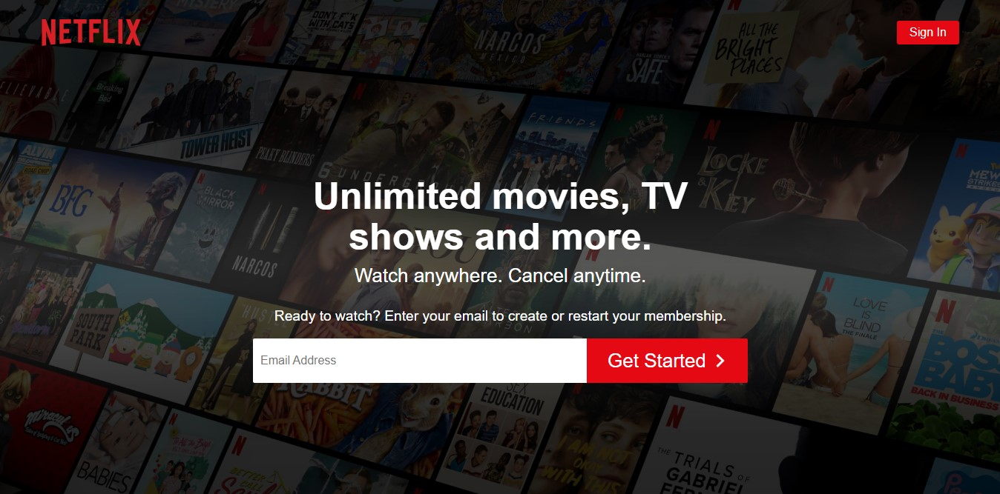
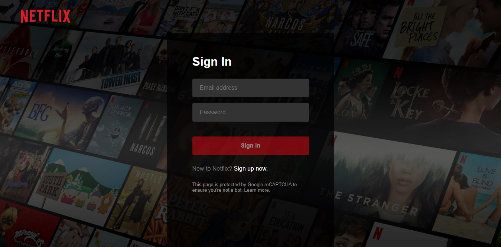
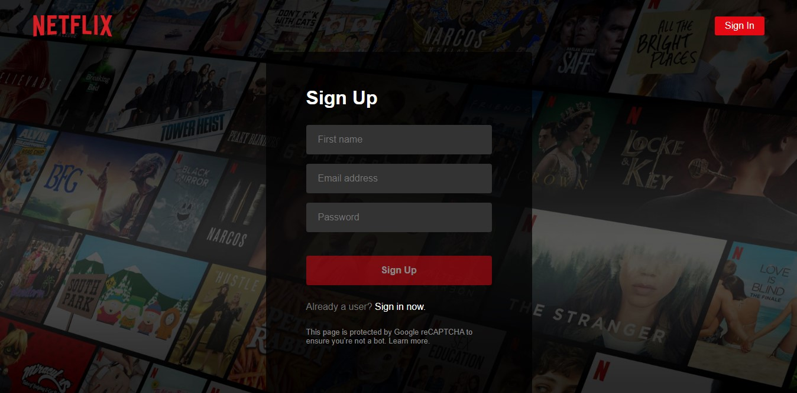
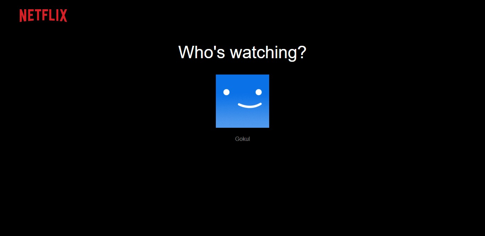
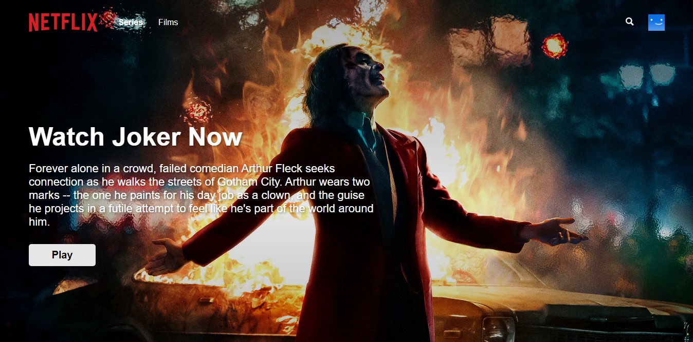
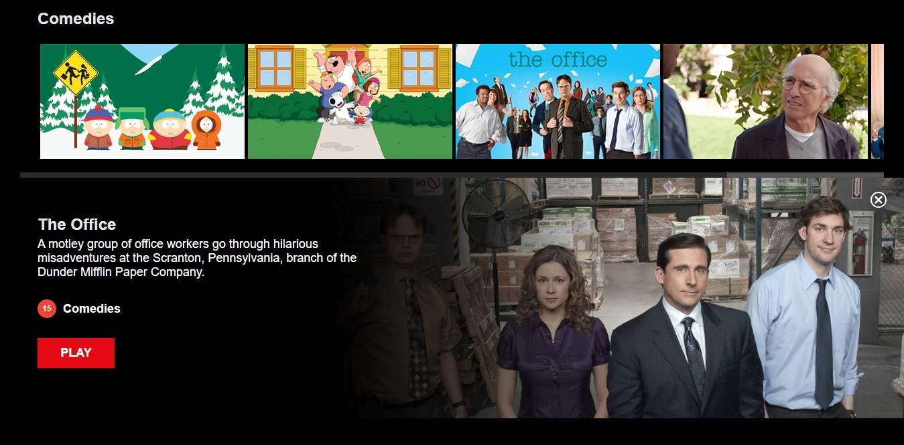
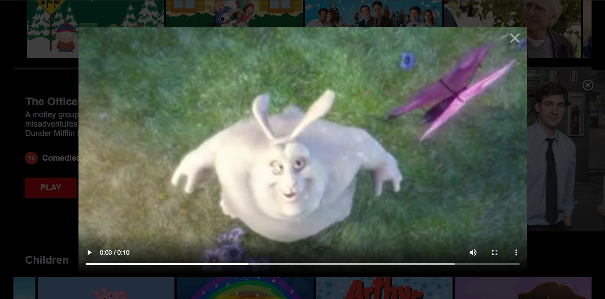

# Netflix Clone using React

### This is a Netflix clone build using React and styled components.

---

## Tech Stack

-   React - Frontend
-   Styled Components - Styling
-   Firebase - Database & Auth
-   Fuse.js - Live Search

---

## Live App:

https://netflix-clone-gk.web.app/

---

## Home Page

## Sign In

## Sign Up

## Who's Watching

## Browse Page

## Feature

## Player

---

### This Netflix clone was built by following [Karl Hadwen's](https://github.com/karlhadwen) youtube [tutorial](https://www.youtube.com/watch?v=x_EEwGe-a9o "Netflix Clone - React Tutorial - Styled Components - Firebase (Firestore & Auth)").

---
